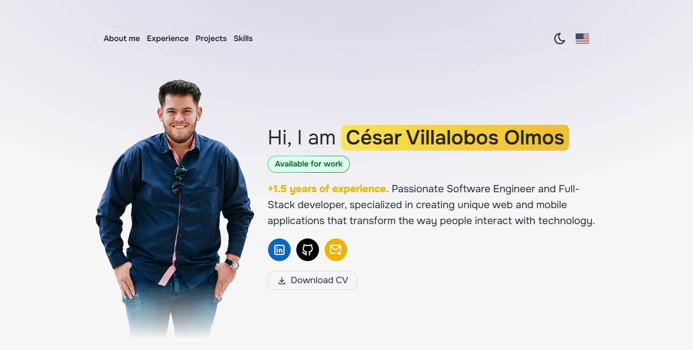

# Cesar Villalobos Olmos

<div style="width: 100%; display: flex; justify-content: center; margin-block: 1rem;">
  
</div>

**Mi portafolio de proyectos** es una aplicación web minimalista y moderna creada con el framework **Astro**. Donde comparto datos de mi perfil profesional, desde mi experiencia, los proyectos en los que he trabajado, las tecnologías que manejo, certificaciones y mucho más sobre mi perfil profesional.

🔗 **Visítalo aquí:** [Portfolio](https://chicho-portfolio.vercel.app/es/)

---

## 📸 Capturas de pantalla

### 🖥️ Página principal


---

## 🚀 Características

- ✅ Sitio web estático optimizado para una alta velocidad y rendimiento.
- ✅ Sistema de rutas automático con Astro.
- ✅ React para crear componentes interactivos del lado del cliente.
- ✅ Estilos modernos y responsive mediante TailwindCSS.
- ✅ Imágenes optimizadas y fuentes personalizadas.
- ✅ Deploy automático con Vercel.

---

## 🛠️ Tecnologías utilizadas

| Tecnología | Descripción |
|------------|-------------|
| [Astro](https://astro.build/) | Framework moderno para sitios rápidos y estáticos. |
| [React](https://react.dev/) | Framework ui para aplicaciones web interactivas. |
| [Vercel](https://www.vercel.com/) | Hosting y despliegue continuo. |
| [Tailwind CSS](https://tailwindcss.com/) | Para estilos rápidos y personalizables. |

---

## 📦 Instalación local

```bash
# Clonar el repositorio
git clone https://github.com/chicho69-cesar/cesar-portfolio.git
cd cesar-portfolio

# Instalar dependencias
npm install

# Ejecutar en modo desarrollo
npm run dev
```

La aplicación estará disponible en <http://localhost:4321>

## 📂 Estructura del proyecto

```txt
cesar-portfolio/
│
├── public/             # Archivos públicos como imágenes
├── src/
│   ├── components/     # Componentes reutilizables
│   ├── data/           # Información de proyectos, tecnologías, certificaciones, etc.
│   ├── islands/        # Componentes interactivos del lado del cliente
│   ├── layouts/        # Layouts base del sitio
│   ├── lib/            # Herramientas para el blog
│   ├── pages/          # Páginas y rutas del blog
│   ├── styles/         # Archivos CSS o Tailwind
│   ├── types/          # Tipado estático mediante typescript
├── astro.config.mjs    # Configuración principal de Astro
└── package.json        # Dependencias y scripts
```

## 🤝 Contribuciones

¿Quieres contribuir con ideas o mejoras? ¡Bienvenido! Puedes:

- Hacer un fork del proyecto.
- Crear una nueva rama (`git checkout -b feature/nueva-funcionalidad`).
- Hacer tus cambios.
- Crear un pull request.
